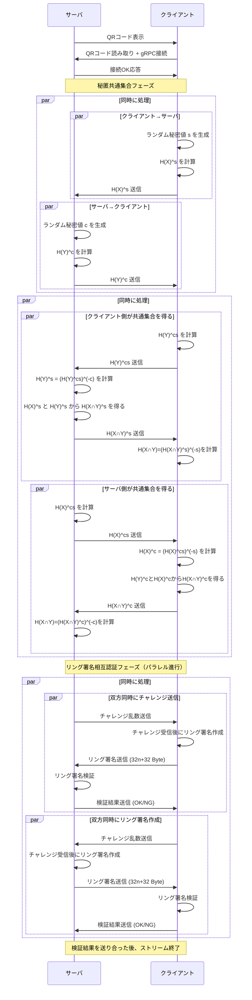

# fluttersample_2025

修士論文「リング署名と秘匿共通集合を組み合わせた顔見知り証明法」のプログラム

- アプリケーション(flutter)
  - 鍵配布
  - 顔見知り確認
- ライブラリ(C++)
  - 鍵ペア生成
  - ハッシュ化
  - 共通集合計算
  - リング署名作成
  - リング署名検証

## 鍵配布

- BLE にて通信する
  - セントラルとペリフェラルを同時に行う
  - 自身の PublicKey をアドバタイズ
  - 他者の PublicKey をスキャン
- 実効速度 10kbps くらいで鍵 33 バイト(=264bit)を送る

## 通信フロー 顔見知り確認

- クライアント: 公開鍵リスト X = {x1, x2, ..., xn} を保持
- サーバ: 公開鍵リスト Y = {y1, y2, ..., ym} を保持

## 暗号ライブラリ関数一覧

| 関数名                | 役割                                           | 引数                                                                                                                      | 戻り値                                              |
| :-------------------- | :--------------------------------------------- | :------------------------------------------------------------------------------------------------------------------------ | :-------------------------------------------------- |
| `GenerateKeyPair`     | 秘密鍵と公開鍵を生成する                       | なし                                                                                                                      | `(std::string privateKey, std::string publicKey)`   |
| `HashPublicKeys`      | 公開鍵リストをハッシュ化する                   | `const std::vector<std::string>& publicKeys`                                                                              | `std::vector<std::string>` ハッシュ済み公開鍵リスト |
| `ComputeCommonSet`    | 自分と相手のハッシュリストから共通集合を求める | `const std::vector<std::string>& myHashes`, `const std::vector<std::string>& peerHashes`                               | `std::vector<std::string>` 共通ハッシュリスト       |
| `CreateRingSignature` | リング署名を作成する                           | `const std::vector<std::string>& publicKeys`, `const std::string& privateKey`, `const std::string& message`         | `std::vector<uint8_t>` リング署名データ             |
| `VerifyRingSignature` | リング署名を検証する                           | `const std::vector<std::string>& publicKeys`, `const std::string& message`, `const std::vector<uint8_t>& signature` | `bool` 検証成功なら`true`                           |
