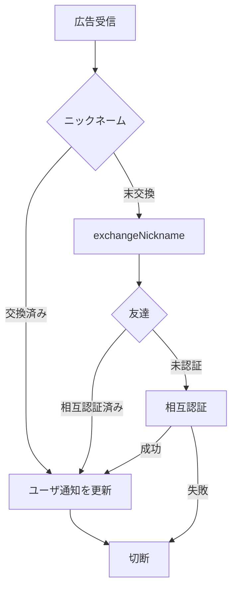
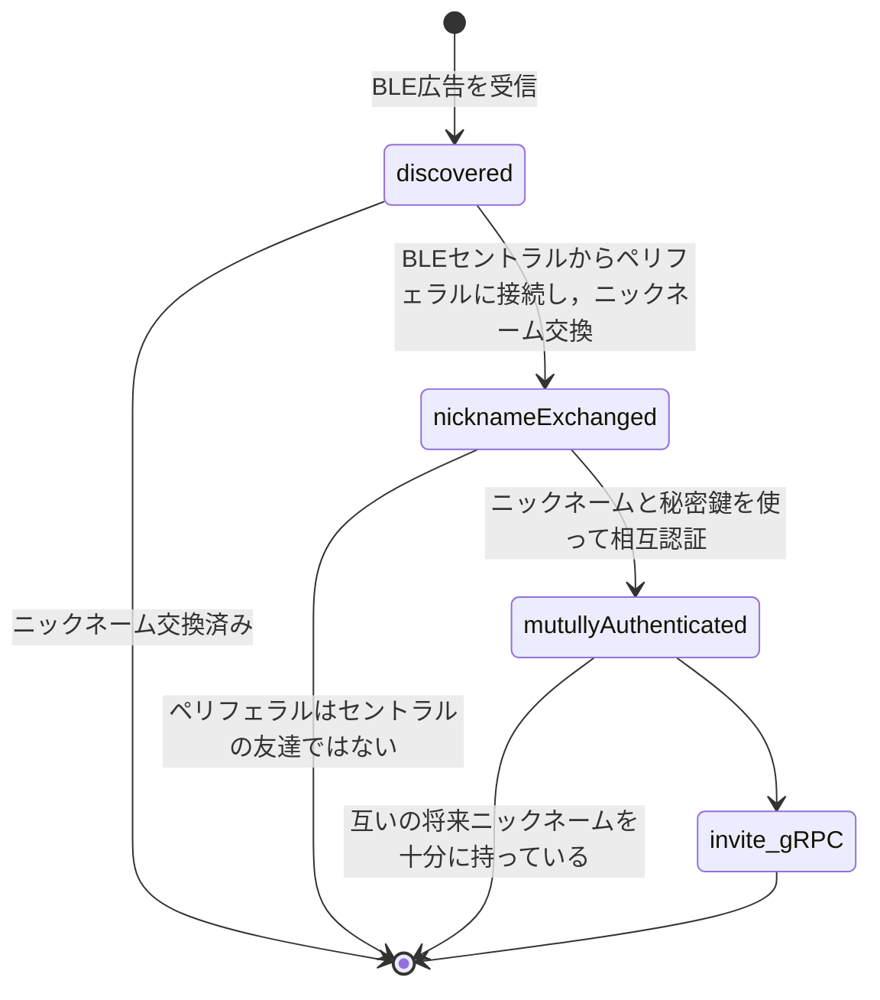
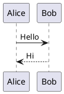

<!-- https://docs.mermaidviewer.com/ja/diagrams/state.html -->
BLEセントラルのフローチャート

```mermaid
flowchart TD
disconnect[切断]

    discovered[広告受信] --> ifAlreadyDiscovered{ニックネーム}
ifAlreadyDiscovered -->|交換済み| UIupdate
ifAlreadyDiscovered -->|末交換| exchangeNickname

exchangeNickname --> ifFriend{友達}
ifFriend -->|相互認証済み| UIupdate[ユーザ通知を更新]
ifFriend -->|未認証| mutuallyAuthencate[相互認証]
mutuallyAuthencate -->|成功| UIupdate
mutuallyAuthencate -->|失敗| disconnect

UIupdate --> disconnect
```

```mermaid
stateDiagram-v2

[*] --> discovered: BLE広告を受信
discovered --> [*]: ニックネーム交換済み

discovered --> nicknameExchanged: BLEセントラルからペリフェラルに接続し，ニックネーム交換
nicknameExchanged --> [*]: ペリフェラルはセントラルの友達ではない

nicknameExchanged --> mutullyAuthenticated: ニックネームと秘密鍵を使って相互認証

mutullyAuthenticated --> [*]: 互いの将来ニックネームを十分に持っている

mutullyAuthenticated --> invite_gRPC

invite_gRPC --> [*]
```

```plantuml
@startuml
Alice -> Bob: Hello
Bob --> Alice: Hi
@enduml
```